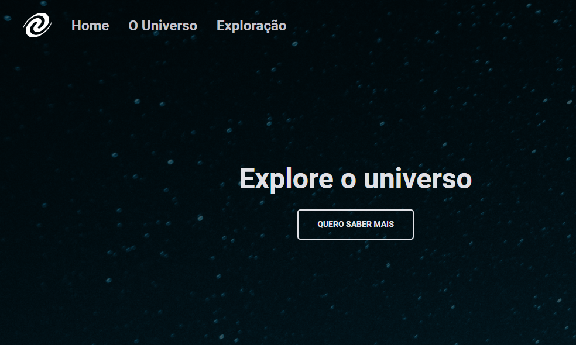

<h1>Project - SPA Universe</h1>

<h2 id="about">About the project</h2>

<ul>
 
In this challenge I had to create an application from a Figma layout in order to practice what I learned in the Stage 06.
  
</ul>

Main skills learned

<ul>
  <li>Single-page application</li>  
  <li>ES6 Modules (Export and Import)</li>
  <li>Object Destructuring</li>
  <li>Objects</li>  
  <li>Classes</li>  
  <li>Use of this</li>  
  <li>Terminal commands</li> 
</ul>

<a href="https://www.figma.com/file/weId9NuhDUtAqaeNjPhQCc/Explorer---SPA-Universe" target="_blank">Figma Layout</a>

<h2 id="tech">Technologies</h2>

<ul>
  <li>HTML</li>
  <li>CSS</li>
  <li>JavaScript</li>
  <li>Node</li>
</ul>

<h2 id="explorer-program">About the Explorer Program</h2>
<ul>
  
The Rocketseat Explorer is a six month intensive Full-Stack program that helps those who are seeking to join the IT field, specifically in Web Development. The Explorer program focus exclusively on hard skills, soft skills and training through hands-on practical activities. The mottos are "never stop learning" and "learn by doing".
  
  <a href="https://www.rocketseat.com.br/explorer" target="_blank">Rocketseat Explorer 
</ul>
